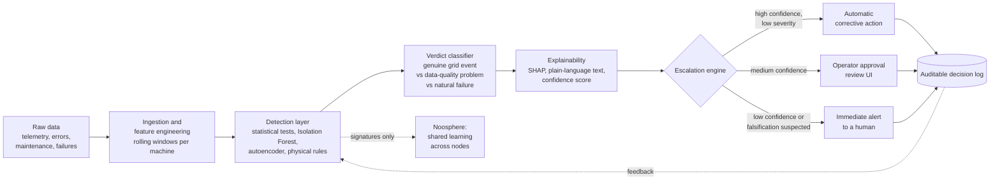

# EnergyMind Tunisia

### Architects of the Energy Noosphere: a Human-AI Collective Intelligence Network for Energy Resilience

**TSYP14 Technical Challenge, IEEE Tunisian Student and Young Professional Congress**

> An explainable, governable AI **trust layer** that sits between raw energy data and automated action. It detects when data or equipment is failing, faulty or feeding the system false information, and it decides transparently when it can act alone and when a human must decide.

---

## Table of contents

1. [Project status](#1-project-status)
2. [Context and problem](#2-context-and-problem)
3. [Objectives](#3-objectives)
4. [Chosen scope](#4-chosen-scope)
5. [Dataset](#5-dataset)
6. [Anomaly taxonomy and simulation plan](#6-anomaly-taxonomy-and-simulation-plan)
7. [System architecture](#7-system-architecture)
8. [Methodology for the four challenge goals](#8-methodology-for-the-four-challenge-goals)
9. [Evaluation plan](#9-evaluation-plan)
10. [Repository structure](#10-repository-structure)
11. [Installation and quick start](#11-installation-and-quick-start)
12. [Notebook roadmap](#12-notebook-roadmap)
13. [Timeline and deliverables](#13-timeline-and-deliverables)
14. [Known limitations and pitfalls](#14-known-limitations-and-pitfalls)
15. [Team](#15-team)
16. [Acknowledgements and data licence](#16-acknowledgements-and-data-licence)

---

## 1. Project status

| Phase | Deadline | Status |
|---|---|---|
| Phase 1: Ideation and data exploration | 15/10/2026 | In progress |
| Phase 2: Solution development and deployment | 12/12/2026 | Planned |

| Notebook | Content | Status |
|---|---|---|
| `00_setup` | Environment, folders, dataset download, shared config | Done |
| `01_data_loading_audit` | Loading and quality audit of the 5 CSV files | Ready, to be run on the real data |
| `02_telemetry_eda` | Exploration of the 4 sensors, machines, time patterns, extremes | Ready, to be run on the real data |
| `03` to `08` | Failures, energy baseline, injection, detection, explainability, noosphere design | Planned |

> Numerical results in this README are filled in only after they have been measured on the real data. Anything marked *to be verified* is an expected order of magnitude, not a result.

---

## 2. Context and problem

Tunisia's grid faces growing strain from:

- seasonal demand peaks,
- fast-expanding renewable energy,
- an increasing number of smart meters,
- a growing number of IoT devices.

Each of these adds measurement points where a fault, a miscalibration or a biased reading can **silently corrupt the data** used by automated systems. As AI takes on more grid decisions, the question is no longer only *"does it predict well?"* but also:

> **Can it be trusted? Who is accountable when it is wrong?**

EnergyMind answers this by placing a trust layer between raw data and automated action.

---

## 3. Objectives

The solution addresses the four goals of the challenge.

| # | Goal | What the system must do |
|---|---|---|
| 1 | **Anomaly and bias detection** | Detect equipment faults, degraded sensors, biased, corrupted or falsified readings, and natural equipment failures. Distinguish a **genuine grid event** from a **data-quality problem**, because they need different responses. |
| 2 | **Confidence scores and explainability** | For every flagged event: a confidence score, a plain-language explanation, and an auditable log of what was detected, concluded and why. No unexaminable black box. |
| 3 | **Human-AI escalation and governance** | Define what the AI may do alone and when a human must decide. Provide an operator interface for review, override and approval. Address both over-trust and under-trust. |
| 4 | **Shared learning across the noosphere** | Document how several nodes (factories, neighbourhoods, microgrids) can share anomaly patterns and calibration insights, with a clear privacy rule: what is shared, what stays local, and why. |

Required by the challenge: a **working single-node prototype**. Multi-node sharing may remain a documented design.

---

## 4. Chosen scope

**Factory power line.** The monitored system is a factory fed by a power line and equipped with **100 machines**, each acting as a monitoring node.

| Signal | Source |
|---|---|
| Voltage (`volt`) | Real column of the dataset (synthetic, normalised units) |
| Rotation (`rotate`), pressure (`pressure`), vibration (`vibration`) | Real columns, used as mechanical context |
| Current, active power, frequency, a simple THD indicator | **Simulated by the team** (not in the dataset) |
| Errors, maintenance, failures | Real labelled events from the dataset |

Why this scope: it matches the structure of the available data (multi-machine, hourly, with real failures), and the "factory power line" is one of the scopes proposed by the challenge.

---

## 5. Dataset

**Microsoft Azure Predictive Maintenance** (Kaggle: `arnabbiswas1/microsoft-azure-predictive-maintenance`).
Synthetic data for 100 machines over one year (01/01/2015 to 01/01/2016), with hourly telemetry.

| File | Content | Key columns | Rows (measured at download) |
|---|---|---|---|
| `PdM_telemetry.csv` | Hourly sensor readings | `datetime, machineID, volt, rotate, pressure, vibration` | 876,100 |
| `PdM_errors.csv` | Non-blocking errors (early warnings) | `datetime, machineID, errorID` (error1 to error5) | 3,919 |
| `PdM_maint.csv` | Component replacements (scheduled or corrective) | `datetime, machineID, comp` (comp1 to comp4) | 3,286 |
| `PdM_failures.csv` | Real component failures | `datetime, machineID, failure` (comp1 to comp4) | 761 |
| `PdM_machines.csv` | Machine metadata | `machineID, model, age` | 100 |

**Join logic.** Every file shares `machineID`; time-stamped files align on `datetime`. Errors tend to precede failures, and a failure usually triggers a maintenance of the same component at the same timestamp (hypothesis checked in Notebook 01).

### What the dataset contains

- Real, labelled **component failures** (the only native anomaly label).
- **Errors** that act as early-warning signals.
- A regular hourly telemetry series for 100 machines.

### What the dataset does not contain

| Missing element | Our answer |
|---|---|
| Current, power, frequency, power quality | Simulated from physical relations, documented in Notebook 04 |
| Smart-meter readings | Optional: hourly energy (kWh) aggregated from simulated power |
| Labelled data-quality anomalies (drift, bias, stuck, falsified) | **Injected** with a ground-truth label column and a parameter log |
| Genuine grid events (sag, surge, outage) | **Injected** simultaneously on several machines |
| Realistic voltage scale | Documented scale factor, or kept as "normalised voltage" |
| STEG data | Optional bonus to add seasonality, if accessible |

A second dataset ("Machine Demand and Failure", which includes power consumption) may be used later to test generalisation.

---

## 6. Anomaly taxonomy and simulation plan

A ground-truth column `label_class` is created, with two derived flags `is_data_quality` and `is_grid_event`. Every injection is recorded in a **parameter log** (machine, start, end, amplitude, random seed), as required by the challenge.

| `label_class` | Injection method | Category | Distinguishing clue |
|---|---|---|---|
| `normal` | none | Normal | reference |
| `sensor_drift` | `volt += alpha * t` (slow ramp) over 3 to 14 days | Data quality | single machine; V inconsistent with I and P |
| `sensor_bias` | `volt * 1.05` or `+ delta` over a period | Data quality | constant offset, single machine |
| `stuck_sensor` | repeat the last value | Data quality | near-zero variance in the window |
| `falsified` | plausible values inconsistent with other sensors | Data quality (security) | broken cross-sensor correlation |
| `grid_sag_surge` | simultaneous voltage dip or rise on several machines | Grid event | many machines at once; I and P consistent |
| `grid_outage` | voltage and current fall to zero on a group | Grid event | multi-machine drop with a coherent electrical signature |
| `natural_failure` | 24 to 72 h window before each row of `PdM_failures` | Natural failure | comes from the dataset (not injected) |

> **Golden rule.** A genuine grid event affects **several machines at once** with mutually consistent measurements. A faulty sensor affects **one machine** and breaks physical consistency. This is the central logic of the trust layer.

Reproducibility: all random operations use `SEED = 42` (from `src/config.py`).

---

## 7. System architecture



**Design principles**

- Interpretable by construction: rule-backed models and tree ensembles with SHAP before any opaque model.
- Every decision is logged: what was detected, what was concluded, why, and who decided.
- Humans stay in the loop wherever confidence is low or the consequence is high.

---

## 8. Methodology for the four challenge goals

### Goal 1: Anomaly and bias detection

- **Features:** rolling mean, standard deviation and slope per machine (3, 6 and 24 h windows), computed on the past only; cross-sensor residuals; cross-machine deviation from the group.
- **Detectors:** statistical outlier methods, Isolation Forest, autoencoder or One-Class SVM (compared), plus **physical-consistency rules** (V, I and P must agree).
- **Verdict:** a classifier that separates *genuine grid event*, *data-quality problem* and *natural failure*, using mainly **cross-machine simultaneity** and **cross-sensor consistency**.

### Goal 2: Confidence scores and explainability

- Confidence score per flagged event (calibrated).
- SHAP values on tree-based models; LIME or rule traces where useful.
- A plain-language explanation generated from the top contributing factors.
- An append-only **decision log** (JSON lines): timestamp, machine, detection, verdict, confidence, main factors, action taken, decision maker.

### Goal 3: Human-AI escalation and governance

Initial policy, **to be calibrated on validation data** (the numbers below are starting values, not results):

| Situation | Action |
|---|---|
| Confidence above 0.9 and low severity | Automatic corrective action (for example flag the reading and fall back to an estimate) |
| Confidence between 0.6 and 0.9 | Operator approval required |
| Confidence below 0.6, or suspected falsification | Immediate alert to a human, no automatic action |

- **Operator interface** (Streamlit): alert queue, explanation, approve, reject and override buttons, audit trail.
- **Over-trust mitigation:** actions with high consequence always need a human; periodic review of automatic decisions; visible confidence and uncertainty.
- **Under-trust mitigation:** transparent explanations, measured precision published in the interface, easy override with feedback so the system learns from operator decisions.

### Goal 4: Shared learning across the noosphere

A node is a group of machines, a factory, a neighbourhood or a microgrid.

| Shared between nodes | Stays local |
|---|---|
| Anomaly signatures (pattern descriptors, not raw series) | Raw telemetry and meter readings |
| Calibration insights (for example typical drift rates per sensor type) | Operator identities and decisions |
| Model parameters or updates (federated learning concept) | Site-specific production data |

Why: raw consumption data can reveal industrial activity and household behaviour, so only abstracted knowledge leaves the node. A documented sharing protocol (what, when, how it is validated against poisoning) will be delivered. The challenge requires this as a **design**; the working prototype is single-node.

---

## 9. Evaluation plan

| Metric | Purpose |
|---|---|
| Precision, recall, F1 per class | Detection quality |
| PR-AUC | Robust to strong class imbalance |
| False-positive rate | Operator workload and trust |
| Verdict accuracy (grid event vs data problem) | Core capability of the trust layer |
| Explanation quality | Checked on sample cases: faithful, readable, verifiable |
| Response latency | Time from reading to verdict |
| Escalation analysis | Share of automatic vs human decisions, and errors in each |

**Protocol:** temporal train/test split (never random), rolling features computed per machine on the past only, test anomalies generated with parameters different from the training ones, fixed random seed.

---

## 10. Repository structure

```text
energymind/
|-- data/
|   |-- raw/            # the 5 original CSVs (never modified, not committed)
|   |-- processed/      # typed and enriched files (parquet / csv)
|   +-- simulated/      # data with injected anomalies + injection log
|-- notebooks/          # 00_ to 08_ (step-by-step analysis)
|-- src/                # reusable code (config, injection, features, rules)
|-- models/             # trained models (joblib)
|-- logs/               # decision log
|-- app/                # operator interface (Streamlit, Phase 2)
|-- docs/               # proposal, diagrams
|   +-- figures/        # figures produced by the notebooks
|-- requirements.txt
+-- README.md
```

Recommended `.gitignore` entries: `data/raw/`, `data/processed/`, `*.parquet`, `*.pkl`, `.ipynb_checkpoints/`, `__pycache__/`. The raw data is about 80 MB and is downloaded by Notebook 00 instead of being committed.

---

## 11. Installation and quick start

**Requirements:** Anaconda (or Miniconda) and a Kaggle account for the dataset download.

```bash
# 1. Create and activate the environment
conda create -n energymind python=3.11 -y
conda activate energymind

# 2. Install dependencies
conda install -c conda-forge pandas numpy scipy scikit-learn matplotlib seaborn jupyterlab -y
pip install shap lime streamlit kagglehub pyarrow

# 3. Launch Jupyter from the project folder
cd path/to/energymind
jupyter lab
```

Then open and run the notebooks **in order**, starting with `notebooks/00_setup.ipynb`. It creates the folders, downloads the dataset into `data/raw/` and writes `src/config.py`.

Make sure each notebook uses the `energymind` kernel (Kernel menu, Change Kernel).

---

## 12. Notebook roadmap

| # | Notebook | What it does | Output |
|---|---|---|---|
| 00 | `00_setup` | Check libraries, create folders, download data, write shared config | `data/raw/*.csv`, `src/config.py` |
| 01 | `01_data_loading_audit` | Load the 5 files, check types, missing values, duplicates, time coverage, integrity between files, failure-maintenance link | Audit tables, `telemetry.parquet` |
| 02 | `02_telemetry_eda` | Distributions, correlations, machine and model profiles, time patterns, autocorrelation, extremes and cross-machine simultaneity | Figures in `docs/figures/`, `machine_profile.csv` |
| 03 | `03_failures_errors_maintenance` | Study failures, errors and maintenance; error-to-failure delays; telemetry before failures; define the pre-failure window | Justified `natural_failure` window |
| 04 | `04_energy_baseline` | Add simulated current, power and frequency; check V, I, P consistency; voltage scale | Enriched dataset and method note |
| 05 | `05_anomaly_injection` | Implement the injections of section 6 with seed and parameter log | Labelled dataset and injection log |
| 06 | `06_detection_baseline` | Rolling features, Isolation Forest, rules, precision / recall / false-positive rate | First quantified results |
| 07 | `07_explainability_escalation` | SHAP, confidence score, plain-language explanation, decision log, escalation rules v1 | Logged example decisions |
| 08 | `08_noosphere_design` | Multi-node sharing scheme, privacy rules, protocol | Diagram and text for the proposal |

Every code cell carries an English comment block explaining what it does and why.

---

## 13. Timeline and deliverables

| Date | Milestone |
|---|---|
| 17/09/2026 | Challenge info session |
| **15/10/2026** | **Phase 1 submission** |
| **12/12/2026** | **Phase 2 final submission** |

**Phase 1 deliverables**

- Project proposal: scope, objectives, data and anomaly-simulation plan, preliminary design for each challenge goal.
- GitHub repository and/or Kaggle notebook with the dataset (or download script) and all Phase 1 code.

**Phase 2 deliverables**

- Full project report: complete workflow, escalation logic, collective-defence design.
- GitHub repository with full solution code, trained models and application files.
- 5-minute demo video; final pitch of 5 minutes of presentation plus a 3-minute demo, in English.

**Scoring (100 points):** Phase 1 pre-selection 50 (requirements 10, technical approach 20, deliverable quality 10, innovation 10); final phase 45 (technical approach 20, prototype 10, presentation 5, deliverables 10); bonus 5 (PES, IES and YP membership in the team, a member with both PES and IES, and coverage of the business scope: budget, implementation, production, continuous training, integration and deployment cost).

---

## 14. Known limitations and pitfalls

- **Synthetic data.** The dataset is simulated, not measured on a real site. Conclusions about real Tunisian grids must be stated with that caveat.
- **Voltage scale.** `volt` is around 170 and is not a real line voltage (230 or 400 V). It is treated as a normalised voltage or rescaled with a documented factor.
- **Weak raw signal.** Raw telemetry is expected to be close to noise, with little signal before failures. Errors and rolling features are expected to carry more information. This will be measured and reported honestly.
- **Simulated energy variables.** Current, power and frequency are built by the team; they model a plausible physical relationship but are not measurements.
- **Injected anomalies are assumptions.** Detection performance on injected anomalies reflects our simulation choices. Test anomalies use different parameters than training anomalies to limit optimistic bias.
- **Class imbalance.** Failures and anomalies are rare; accuracy alone is never reported.
- **Data leakage.** Temporal splits only, features computed per machine on the past only.
- **Single-node prototype.** Multi-node sharing is a documented design in this challenge, not a deployed system.

---

## 15. Team

| Role | Member | Responsibilities |
|---|---|---|
| Data and EDA | *to be filled* | Notebooks 01 to 03 |
| Simulation | *to be filled* | Notebooks 04 and 05, injection log |
| Modelling | *to be filled* | Notebook 06, metrics |
| Explainability and escalation | *to be filled* | Notebook 07, decision log, interface |
| Design and writing | *to be filled* | Notebook 08, proposal, business scope |

Maximum 5 members per team. IEEE memberships (PES, IES, YP) of each member: *to be filled* (relevant for the bonus points).

Contact for challenge clarifications: ranimdamak@ieee.org, mohamedali.krichen@ieee.org.

---

## 16. Acknowledgements and data licence

- Challenge: **TSYP14 Technical Challenge, EnergyMind Tunisia**, organised by the IEEE Tunisia Section with IEEE PES Tunisia, IEEE IES Tunisia Chapter, Student Activities Committee and Young Professionals.
- Dataset: Microsoft Azure Predictive Maintenance, redistributed on Kaggle by `arnabbiswas1`. Check the dataset page for the exact licence and terms of use before redistributing any data.
- Source links were verified on Kaggle on September 26, 2026 (see the dataset options sheet provided with the challenge).

*Project licence: to be chosen by the team before making the repository public.*
